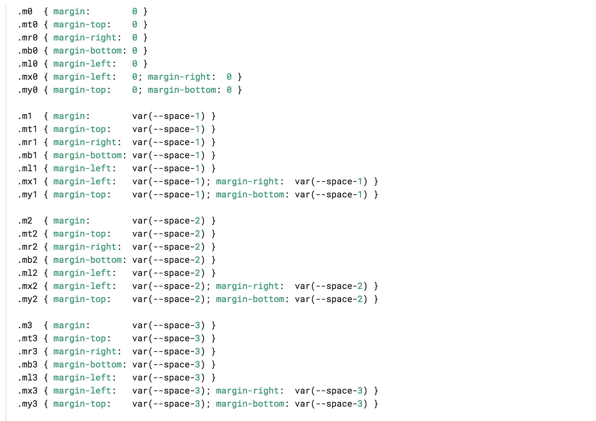

## "Atomic CSS" is also loosely referred to as:
- "OOCSS"
- "Functinal CSS"
- "Single-purpose, reusable classes"
- "the multi-classname approach"

## "Atomic CSS" looks like:
- classes made up of single `property: value` declarations, ie:

<a class="right" href="2.html">next</a>